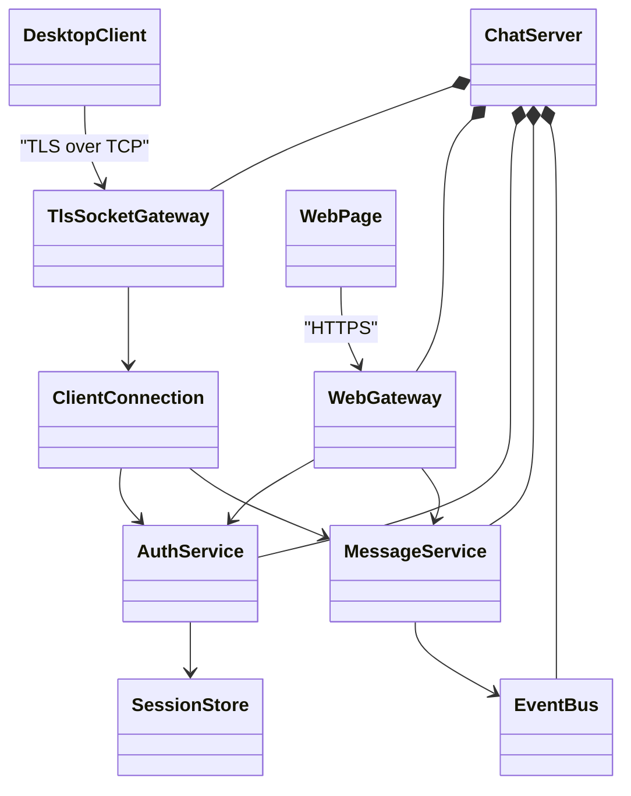

# TLS Chat

Учебный проект: защищённый корпоративный чат с шифрованием TLS.

## Архитектура

```mermaid
classDiagram
    class ChatServer
    class TlsSocketGateway
    class WebGateway
    class ClientConnection
    class AuthService
    class MessageService
    class EventBus
    class SessionStore
    class DesktopClient
    class WebPage

    ChatServer *-- TlsSocketGateway
    ChatServer *-- WebGateway
    ChatServer *-- AuthService
    ChatServer *-- MessageService
    ChatServer *-- EventBus

    TlsSocketGateway --> ClientConnection
    ClientConnection --> AuthService
    ClientConnection --> MessageService
    WebGateway --> AuthService
    WebGateway --> MessageService
    AuthService --> SessionStore
    MessageService --> EventBus

    DesktopClient --> TlsSocketGateway : "TLS over TCP"
    WebPage --> WebGateway : "HTTPS"
```
